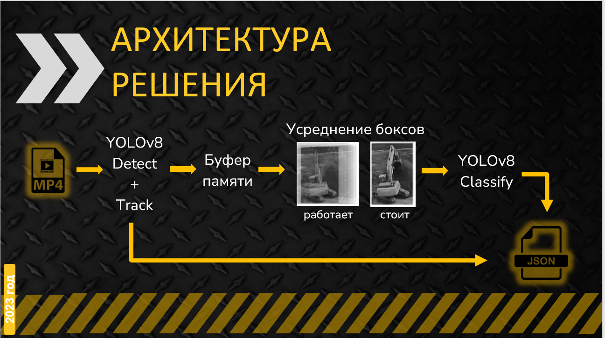
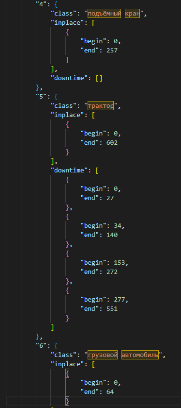
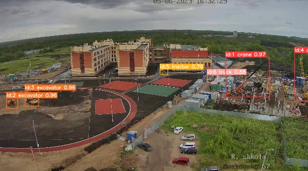
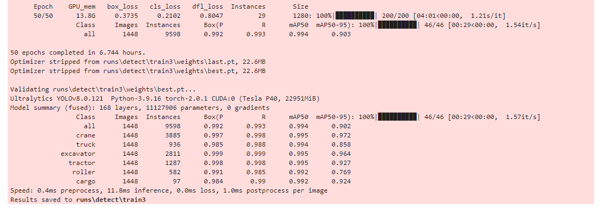
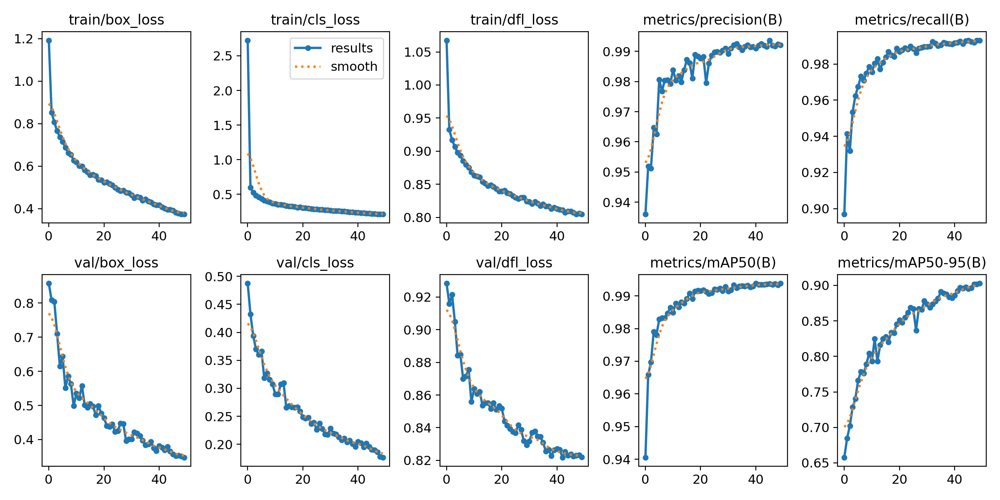

# Выявление фактического времени работы строительной техники с помощью моделей компьютерного зрения



Строительная отрасль является быстрорастущей сферой видеоаналитики, и искусственный интеллект играет в ней важную роль.
Использование моделей глубокого обучения в строительстве может сэкономить сотни тысяч рублей в течение жизненного цикла проекта и может быть гораздо более эффективным, чем традиционные методы.
Представленная нами модель предназначена для мониторинга работы техники на строительной площадке на основе видео с обзорной камеры. 
Приложение позволяет определять фактическое количество строительной техники, присутствующих на объекте, её виды  а также процесс деятельности - работа/простой в течение суток, с указанием тайминга событий.
Наше решение позволит оценить соответствие реального хода строительства с проектными планами, оптимизировать использование строительной техники, сократить простои.

**Стек решения**: Python, PyTorch, LabelImg, Albumentations, YOLOv8.

При обучении моделей используется глубокая аугментация обучающего датасета, что позволяет ей оставаться устойчивой к различным условиям на площадке.


## Цель
 
Разработанный модуль получает на вход видео файл. Результатом работы будет json файл с описание техники, присутствующей в кадре,
классом техники, временем присутствия в кадре и временем простоя.



Также модуль позволяет получить видео файл с детекцией техники в кадре. Каждой единицы спецтехники присваивается идентификатор и
составляется трек движения.



Классы техники:
- подъёмный кран
- грузовой автомобиль
- экскаватор
- трактор
- каток
- грузовичок (газель)


## Установка

Клонируем репозиторий создаем виртуальную среду и устанавливаем зависимости

```
git clone https://github.com/EvgenyKondratev/2023year.git

cd 2023year
python -m venv ./venv
./venv/Scripts/activate

pip install -r ./requirements.txt
```

## Команда --help

Для вызова справки по использованию данного модуля выполните команду `python 2023year.py --help`

```
usage: 2023year.py [-h] -v VIDEO_PATH [-w WEIGHTS] [-wcl WEIGHTS_CL]
                   [-fw FRAME_WIDTH] [-fh FRAME_HEIGHT] [-s SEC]
                   [-o OUT_VIDEO_FILENAME] [-j OUT_JSON_FILENAME]

2023year predict events from video

options:
  -h, --help            show this help message and exit
  -v VIDEO_PATH, --video_path VIDEO_PATH
                        Path to video file
  -w WEIGHTS, --weights WEIGHTS
                        Detection model weights file
  -wcl WEIGHTS_CL, --weights_cl WEIGHTS_CL
                        Classification model weights file
  -fw FRAME_WIDTH, --frame_width FRAME_WIDTH
                        Frame width (default=640)
  -fh FRAME_HEIGHT, --frame_height FRAME_HEIGHT
                        Frame height (default=360)
  -s SEC, --sec SEC     Sec to read (int) (default=None)
  -o OUT_VIDEO_FILENAME, --out_video_filename OUT_VIDEO_FILENAME
                        Output video filename (default=None)
  -j OUT_JSON_FILENAME, --out_json_filename OUT_JSON_FILENAME
                        Output json filename (default='result.json')
```


## Примеры использования

- Результат работы только json файл с именем `result.json`
```
python 2023year.py -v ./demo/1.mp4
```

- Результат работы только json файл с именем `new_result.json`
```
python 2023year.py -v ./demo/1.mp4 -j new_result.json
```

- Результат работы json файл с именем `result.json` и видео файл с именем `result.mp4`
```
python 2023year.py -v ./demo/1.mp4 -o result.mp4
```

- Обработать только первые 20 секунд видеофайла и получить json файл с именем `result.json`
```
python 2023year.py -v ./demo/1.mp4 -s 20
```

- Обрабатывать видео в другом разрешении, например 1280 х 720, результатом будет json файл с именем `result.json`
```
python 2023year.py -v ./demo/1.mp4 -fw 1280 -fh 720
```

- Применить сторонние веса для модели Yolo для детекции и трекинга спецтехники, результатом будет json файл с именем `result.json`
```
python 2023year.py -v ./demo/1.mp4 -w yolov8s_2023.pt
```

- Применить сторонние веса для модели Yolo для классификации спецтехники на предмет простоя, результатом будет json файл с именем `result.json`
```
python 2023year.py -v ./demo/1.mp4 -wcl yolov8n_2023.pt
```

## Обучение

```
from ultralytics import YOLO
model = YOLO("yolov8s.yaml")
model = YOLO('yolov8s.pt')
model.train(data="hack.yaml", imgsz = 1280, batch= -1, epochs=50) 
```





## Итоги

Данный модуль может выступать как MVP и быть легко интегрирован в сферу видиоаналитики не только строительной отрасли, но и другие отраслей.